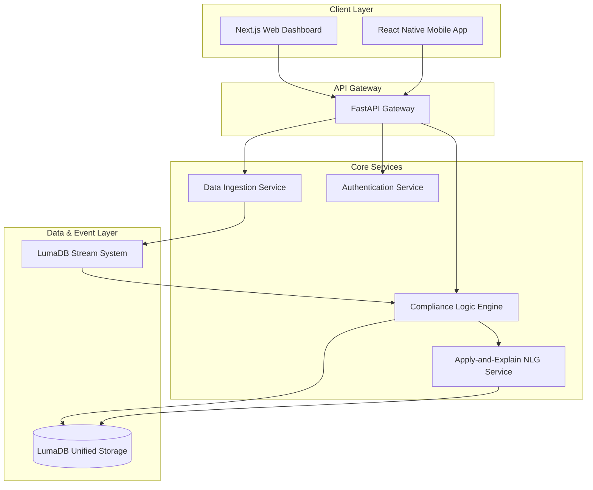

# RegTech Horizon: Architecture Specification

## 1. Executive Summary
RegTech Horizon is a distributed, event-driven platform designed for multi-jurisdictional compliance automation. It leverages a microservices architecture to handle high-throughput data ingestion, real-time logic processing, and immutable reporting.

## 2. System Architecture
### 2.1 High-Level Overview
The system consists of three primary layers:
1.  **Ingestion Layer**: Handles raw data streams from ERPs, Telemetry, and Manual uploads.
2.  **Processing Layer**: Applies regulatory rules, aggregates data, and generates alerts.
3.  **Presentation Layer**: Delivers insights via Web Dashboard and Mobile App.

### 2.2 Component Details
- **LumaDB Integration**:Replaces legacy PostgreSQL/S3/Kafka stack.
  - **SQL Interface**: Stores structured compliance data (Users, Reports, Rules).
  - **Stream Interface**: Handles event logging and telemetry (comparable to Kafka topics).
  - **Object Storage**: Stores generated PDFs and evidence files.

- **Microservices**:
  - `src/ingestion_layer`: Python-based file watchers and webhook endpoints.
  - `src/modules/*`: specialized logic for NCC, FCC, and CBN regulations.
  - `mobile/`: React Native (Expo) app for field officers.

### 3. Data Flow Architecture
1.  **Ingestion**: Raw data enters via `watchdog` monitoring or API.
2.  **Normalization**: Data is validated against Pydantic models.
3.  **Streaming**: Validated events are published to `system_events` table in LumaDB.
4.  **Processing**: Subscribers (Logic Engine) consume events, apply rules, and generate `ComplianceResult`.
5.  **Reporting**: Aggregated results are stored for dashboard visualization.

### 4. Security Architecture
- **Authentication**: JWT-based stateless auth.
- **Encryption**: TLS 1.3 for transit, AES-256 for LumaDB storage (native).
- **Audit Logging**: All write operations trigger an immutable audit log entry.

### 5. Deployment Architecture
- **Containerization**: All services are Dockerized.
- **Orchestration**: Docker Compose for single-node, Kubernetes (Helm) for scale.
- **CI/CD**: GitHub Actions pipeline for linting, testing, and image build.
